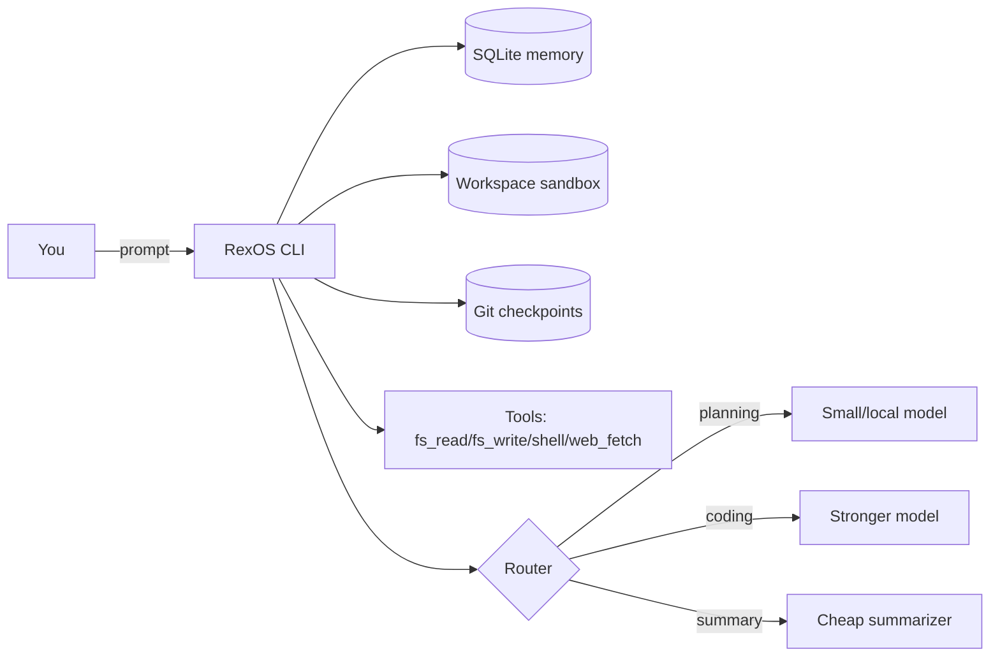

<div class="rexos-hero" markdown>

# RexOS

**Long-running Agent OS**: durable harness + SQLite memory + sandboxed tools + multi-provider routing.

[Get started (Ollama)](tutorials/quickstart-ollama.md){ .md-button .md-button--primary }
[Harness tutorial](tutorials/harness-long-task.md){ .md-button }
[Providers & routing](how-to/providers.md){ .md-button }
[Use cases](how-to/use-cases.md){ .md-button }

<p class="rexos-muted">
Develop locally with small models on Ollama, then switch routing to GLM / MiniMax / DeepSeek / Kimi / Qwen when you need more capability.
</p>

</div>

<div class="grid cards" markdown>

- :material-checklist: **Harness-first long tasks**  
  Work like “change → verify → checkpoint”, across many runs.  
  [Learn harness](tutorials/harness-long-task.md)

- :material-database: **SQLite-backed memory**  
  Sessions, messages, and small KV state live in `~/.rexos/rexos.db`.  
  [Concepts](explanation/concepts.md)

- :material-shield-lock: **Sandboxed tools**  
  Workspace-scoped file IO + shell + SSRF-protected `web_fetch`.  
  [Security model](explanation/security.md)

- :material-router: **Multi-provider routing**  
  Route planning/coding/summary to different providers/models.  
  [Configure providers](how-to/providers.md)

</div>

## Quickstart (local, with Ollama)

```bash
# 1) Start Ollama
ollama serve

# 2) Init RexOS (~/.rexos/config.toml + ~/.rexos/rexos.db)
rexos init

# 3) Run a workspace session
mkdir -p /tmp/rexos-work
rexos agent run --workspace /tmp/rexos-work --prompt "Create hello.txt with the word hi"
```

## How it works



## Next steps

- Learn the harness loop: `tutorials/harness-long-task.md`
- Explore common recipes: `how-to/use-cases.md`
- Switch providers (GLM/MiniMax native included): `how-to/providers.md`
