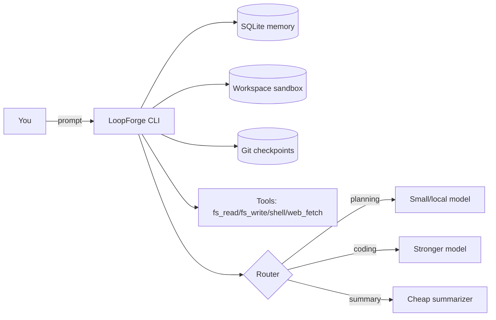

<div class="rexos-hero" markdown>

# LoopForge

**Long-running Agent OS by Rex**: durable harness + SQLite memory + sandboxed tools + multi-provider routing.

[Get started (Ollama)](tutorials/quickstart-ollama.md){ .md-button .md-button--primary }
[Harness tutorial](tutorials/harness-long-task.md){ .md-button }
[Beginner FAQ](how-to/faq.md){ .md-button }
[Providers & routing](how-to/providers.md){ .md-button }
[Use cases](how-to/use-cases.md){ .md-button }
[Case tasks](examples/case-tasks/index.md){ .md-button }
[Growth blog](blog/index.md){ .md-button }
[Browser use cases](how-to/browser-use-cases.md){ .md-button }

<p class="rexos-muted">
Develop locally with small models on Ollama, then switch routing to GLM / MiniMax / DeepSeek / Kimi / Qwen / NVIDIA NIM when you need more capability.
</p>

</div>

> Brand update: LoopForge is the public name (formerly RexOS). CLI command is `loopforge`; config/data path remains `~/.rexos`.

<div class="grid cards" markdown>

- :material-checklist: **Harness-first long tasks**  
  Work like “change → verify → checkpoint”, across many runs.  
  [Learn harness](tutorials/harness-long-task.md)

- :material-database: **SQLite-backed memory**  
  Sessions, messages, and small KV state live in `~/.rexos/rexos.db`.  
  [Concepts](explanation/concepts.md)

- :material-shield-lock: **Sandboxed tools**  
  Workspace-scoped file IO + shell + SSRF-protected `web_fetch`.  
  [Security model](explanation/security.md)

- :material-router: **Multi-provider routing**  
  Route planning/coding/summary to different providers/models.  
  [Configure providers](how-to/providers.md)

</div>

## Quickstart (local, with Ollama)

Make sure you have at least one **chat model** available in Ollama (not embedding-only). If the default `llama3.2` isn’t installed, either `ollama pull llama3.2` or change `providers.ollama.default_model` in `~/.rexos/config.toml` (see the Quickstart tutorial).

=== "macOS/Linux"
    ```bash
    # 1) Start Ollama
    ollama serve

    # 2) Init LoopForge
    loopforge init

    # 3) Run a workspace session
    mkdir -p rexos-work
    loopforge agent run --workspace rexos-work --prompt "Create hello.txt with the word hi"
    ```

=== "Windows (PowerShell)"
    ```powershell
    # 1) Start Ollama
    ollama serve

    # 2) Init LoopForge
    loopforge init

    # 3) Run a workspace session
    mkdir rexos-work
    loopforge agent run --workspace rexos-work --prompt "Create hello.txt with the word hi"
    ```

## How it works



## Next steps

- Learn the harness loop: `tutorials/harness-long-task.md`
- Explore common recipes: `how-to/use-cases.md`
- Start from beginner Q&A: `how-to/faq.md`
- Copy/paste 10 practical tasks: `examples/case-tasks/ten-copy-paste-tasks.md`
- Read the brand intro: `blog/what-is-loopforge.md`
- Read the positioning article: `blog/rexos-vs-openfang-openclaw.md`
- Switch providers (GLM/MiniMax native + NVIDIA NIM included): `how-to/providers.md`
