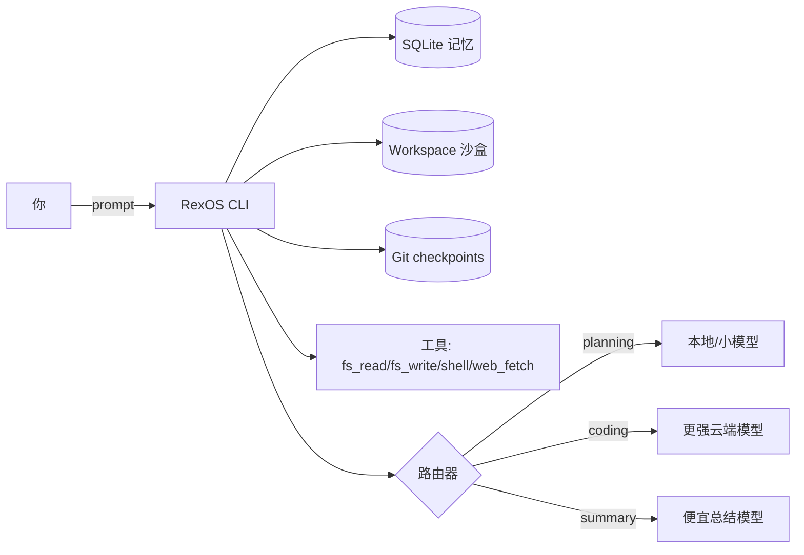

<div class="rexos-hero" markdown>

# RexOS

简体中文 | [English](../index.md)

**长任务 Agent OS**：durable harness + SQLite 记忆 + 工具沙盒 + 多 Provider 路由。

[快速开始（Ollama）](tutorials/quickstart-ollama.md){ .md-button .md-button--primary }
[Harness 长任务](tutorials/harness-long-task.md){ .md-button }
[Providers 与路由](how-to/providers.md){ .md-button }
[常见场景](how-to/use-cases.md){ .md-button }

<p class="rexos-muted">
研发调试阶段用 Ollama 小模型先跑通逻辑；需要更强能力时，把路由切到 GLM / MiniMax / DeepSeek / Kimi / Qwen。
</p>

</div>

<div class="grid cards" markdown>

- :material-checklist: **Harness 驱动的长任务**  
  固化循环：修改 → 验证 → checkpoint，多次运行持续推进。  
  [了解 Harness](tutorials/harness-long-task.md)

- :material-database: **SQLite 持久化记忆**  
  sessions/messages/KV 等写入 `~/.rexos/rexos.db`，便于续跑。  
  [概念](../explanation/concepts.md)

- :material-shield-lock: **工具沙盒**  
  文件读写与 shell 仅在 workspace 内执行，`web_fetch` 默认 SSRF 防护。  
  [安全模型](../explanation/security.md)

- :material-router: **多 Provider 路由**  
  将 planning/coding/summary 路由到不同 provider/model。  
  [配置 Providers](how-to/providers.md)

</div>

## 快速开始（本地 Ollama）

```bash
# 1) 启动 Ollama
ollama serve

# 2) 初始化 RexOS（~/.rexos/config.toml + ~/.rexos/rexos.db）
rexos init

# 3) 在 workspace 里跑一次 session
mkdir -p /tmp/rexos-work
rexos agent run --workspace /tmp/rexos-work --prompt "Create hello.txt with the word hi"
```

## 工作方式



## 下一步

- Harness 长任务教程：`tutorials/harness-long-task.md`
- 常见场景与配方：`how-to/use-cases.md`
- Provider 切换与原生 API：`how-to/providers.md`
